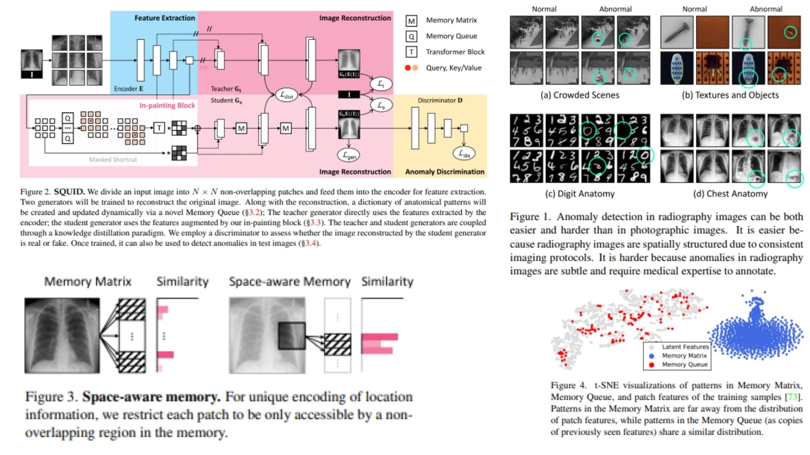

# 🐙 SQUID-Replication — Student-Teacher Inpainting for Anomaly Detection

This repository provides a **faithful Python replication** of the **SQUID framework** for pixel-level anomaly detection in radiography images.  
The goal is to **reproduce the model, math, and block diagram from the paper** without full-scale training.

Highlights:

* **Pixel-wise anomaly detection** via student-teacher distillation 🧩  
* Memory-augmented **inpainting pipeline** for subtle anomalies 🖼️  
* Anomaly maps $$A$$ and image-level scores $$\max(A)$$ 📈  

Paper reference: *[SQUID: Student-Teacher Inpainting for Unsupervised Anomaly Detection](https://arxiv.org/abs/2111.13495)*  

---

## Overview 🎨



> The pipeline trains a **student generator** to reconstruct images using features augmented by a **memory-aware inpainting block**, while a **teacher generator** is pretrained on anomaly-free images.  
> Pixel-level anomalies are detected by comparing student reconstructions to teacher-guided expectations.

Key points:

* **Teacher generator**: pretrained, anomaly-free features 🧊  
* **Student generator**: trained with inpainting to match teacher patterns ✨  
* **Memory Queue**: stores anatomical patterns for context-aware reconstruction 💾  
* **Anomaly map** $$A$$: high values indicate pixel-level deviations  
* **Image-level score**: $$\max(A)$$

---

## Core Math 📐

**Reconstruction losses** (student and teacher):

$$
L_{rec} = \| G_s(F') - I \|_2^2 + \| G_t(E(I)) - I \|_2^2
$$

**Knowledge distillation**:

$$
L_{dist} = \| F'_s - F_t \|_2^2
$$

**Adversarial losses**:

$$
L_{adv} = \text{BCE}(D(G_s(F')), 1) + \text{BCE}(D(I), 0)
$$

**Anomaly score** at pixel $(i,j)$:

$$
A_{ij} = \sigma \Bigg( \frac{D(G_s(F'))_{ij} - \mu}{\sigma} \Bigg)
$$

- $$F'$$ = student features after inpainting  
- $$G_s, G_t$$ = student & teacher generators  
- $$D$$ = discriminator  
- $$\sigma$$ = sigmoid for normalizing anomaly scores  

---

## Why SQUID Matters 🌿

* Learns **subtle radiography anomalies** without labeled abnormal data 🔬  
* Memory-aware inpainting handles **anatomical overlaps and subtle deviations** 🧠  
* Modular: backbone, memory, and generators can be replaced or extended 🛠️  
* Student-teacher distillation ensures **high fidelity reconstructions** 🪞  

---

## Repository Structure 🏗️

```bash
SQUID-Replication/
├── src/
│   ├── backbone/
│   │   └── encoder.py            # E(I): image → patch features
│   │
│   ├── memory/
│   │   ├── memory_queue.py       # space-aware memory queue
│   │   └── similarity.py         # similarity + top-k
│   │
│   ├── layers/
│   │   ├── transformer.py        # inpainting attention
│   │   └── masked_shortcut.py    # F' = (1-δ)F + δ·inpaint(F)
│   │
│   ├── modules/
│   │   ├── inpainting.py         # memory + transformer → F'
│   │   ├── generators.py         # teacher & student
│   │   └── discriminator.py      # D(x)
│   │
│   ├── losses/
│   │   └── losses.py             # reconstruction + distillation + adversarial
│   │
│   ├── utils/
│   │   └── anomaly.py            # pixel-wise anomaly score
│   │
│   ├── model/
│   │   └── squid_model.py        # full forward pipeline
│   │
│   └── config.py                 # hyperparameters, memory size, δ, stride
│
├── images/
│   └── figmix.jpg                 # overview figure
│
├── figures/
│   └── figmix.jpg                       # additional figures from paper
│
├── requirements.txt
└── README.md
```

---

## 🔗 Feedback

For questions or feedback, contact:  
[barkin.adiguzel@gmail.com](mailto:barkin.adiguzel@gmail.com)
